[TOC]

# 无人值守安装Ubuntu 18.04.4

## 软件环境

---

虚拟机：Virtualbox

镜像：ubuntu-18.04.4-server-amd64.iso

双网卡：

1. NAT IP：10.0.2.15
2. Host-Only IP：192.168.56.101


---

## 实验问题

* 如何配置无人值守安装iso并在Virtualbox中完成自动化安装?
* Virtualbox安装完Ubuntu之后新添加的网卡如何实现系统开机自动启用和自动获取IP？
* 如何使用sftp在虚拟机和宿主机之间传输文件？

---

## 实验前知识点准备


* 镜像：一个磁盘上的数据在另一个磁盘上存在一个完全相同的副本。

* ssh：远程网络传输中，一种安全传输方式或者传输协议。

* putty：windows下连接linux的工具，直接打开后，输入要连接的linux机器的ip，用户和密码即可。

* Host-only：主机模式，相当于虚拟机和宿主机通过交叉线相连，可以互访，但不能直接访问。

     背景：A是本机，A1，A2是虚拟机，B是外部联网的机器

  * host-only（主机模式）: A可以和A1,A2互通，A1，A2 -> B不可以，B -> A1,A2不行
  * bridge（桥接模式）: A可以和A1,A2互通，A1，A2 -> B可以，B -> A1,A2可以
  * nat（网络地址转换）: A可以和A1,A2互通，A1，A2 -> B可以，B -> A1,A2不行
  
* SSH跳板机：为了安全并高效的管理服务器，需要通过终端连接到远程开发机进行工作，由于安全等因素，登录开发机时需要先登录跳板机，然后在跳板机上再实际连接开发机。

* PSFTP：是Putty SFTP客户端，用于本地与服务器间安全传输文件（使用SSH[连接](https://baike.baidu.com/item/连接/70199)）。

---

## 实验步骤

### 1.  手动安装Ubuntu18.04

**用户名**：wocbug

**配置双网卡**

```bash
sudo vi /etc/netplan/01-netcfg.yaml
```

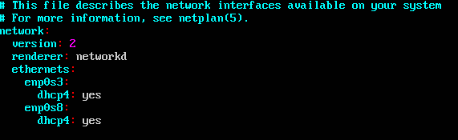

用v进入编辑模式，选中enp0s3:和dhcp4:yes两行，用y复制，用p粘贴，再按v推出编辑模式。

在命令模式按i进行修改，将enp0s3改为enp0s8。

**配置成功**

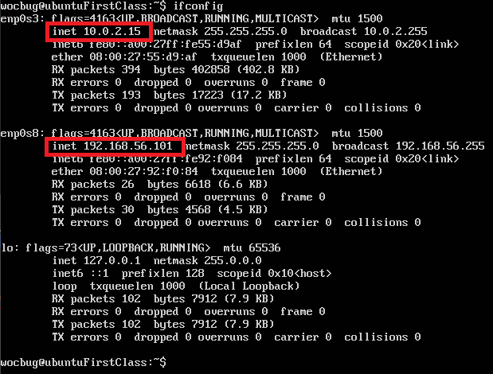

**NAT**：10.0.2.15

**Host-Only**：192.168.56.101

**使用putty连接Linux**

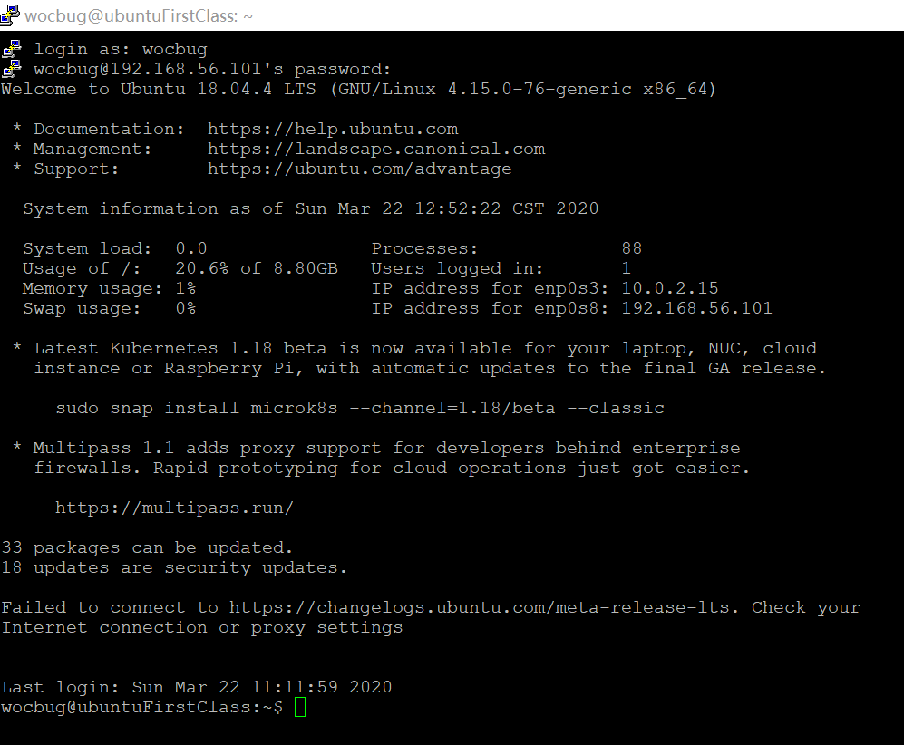

---

### 2. 配置SSH免密登录

用chocolatey生成公钥-私钥对

进入路径下输入ssh-keygen

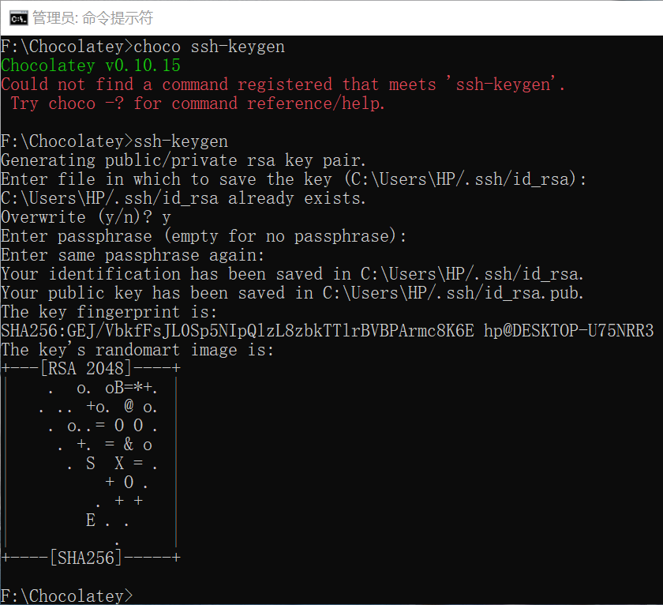

查看公钥生成成功：

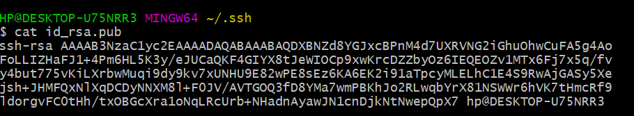

在Windows上安装openssh客户端：

（Chocolatey安装OpenSSH总是超时，暂未解决，所以手动安装）

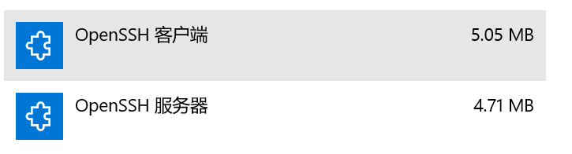

配置：

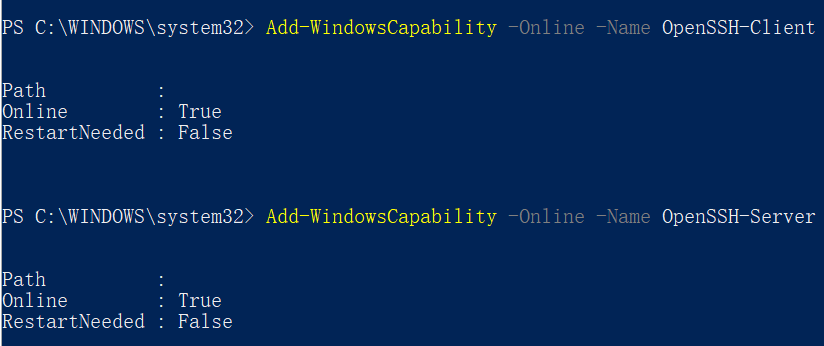

Linux下安装openssh服务端：

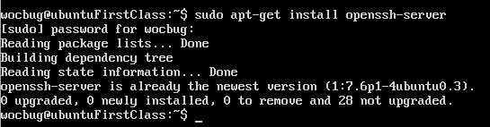

开启ssh服务：


复制id_rsa.pub文件：

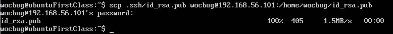

id_rsa.pub添加到.ssh/authorzied_keys文件：


putty中测试：

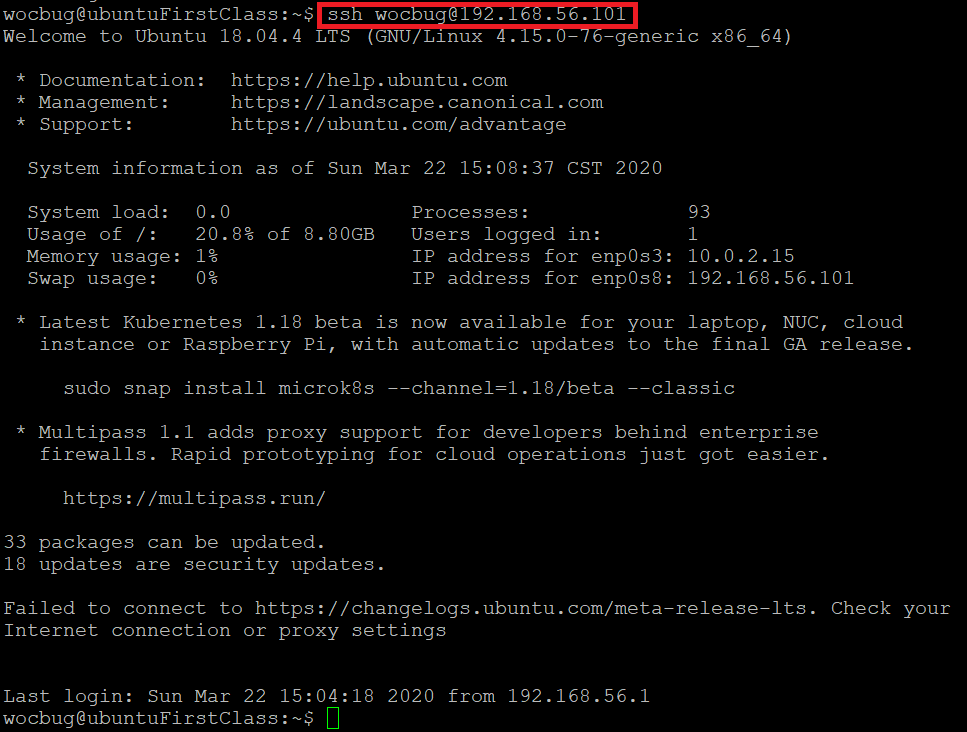

虚拟机中测试：

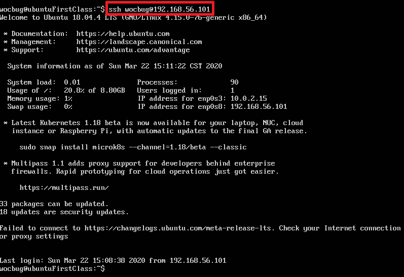

---

### 3. 定制镜像

1. 使用psftp将镜像传送到/home/wocbug

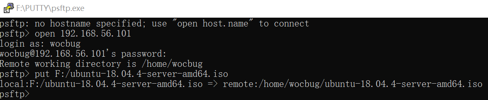

2. 回到PUTTY，在当前用户目录下创建一个用于挂载iso镜像文件的目录

```bash
mkdir loopdir
```

3. 挂载iso镜像文件到该目录

```bash
mount -o loop ubuntu-18.04.4-server-amd64.iso loopdir
```

报错：only root can use "--options" option，普通用户没有对该目录的操纵权限

解决方法：用sudo命令以系统管理员身份执行指令

```bash
sudo mount -o loop ubuntu-18.04.4-server-amd64.iso loopdir
```

 WARNING: device write-protected, mounted read-only.

4. 创建一个工作目录用于克隆光盘内容

```bash
 mkdir cd
```

5. 同步光盘内容到目标工作目录

```bash
 rsync -av loopdir/ cd
```

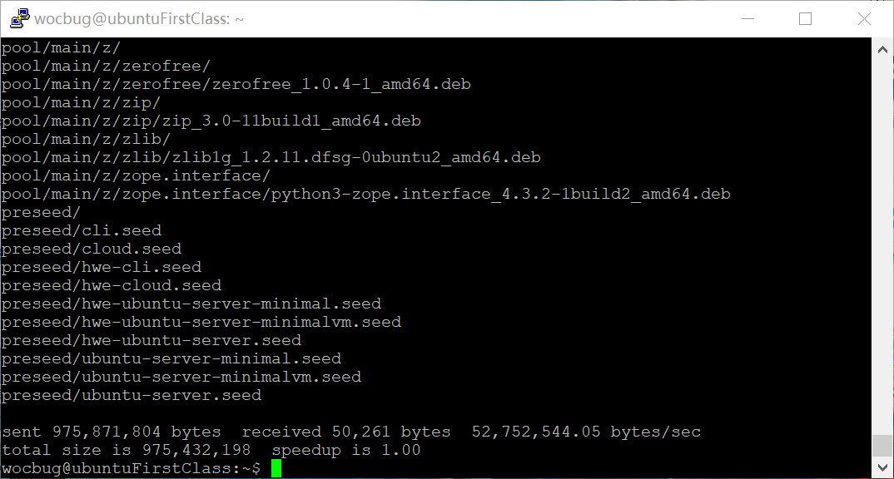

6. 卸载iso镜像

```bash
sudo umount loopdir
```

7. 进入目标工作目录

```bash
cd cd/
```
8. 编辑Ubuntu安装引导界面增加一个新菜单项入口

```bash
vim isolinux/txt.cfg
```

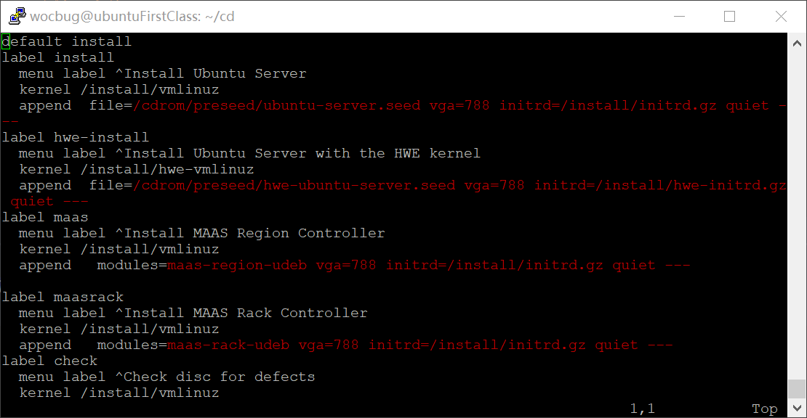

1. 添加以下内容到该文件后强制保存退出

```bash
label autoinstall
  menu label ^Auto Install Ubuntu Server
  kernel /install/vmlinuz
  append  file=/cdrom/preseed/ubuntu-server-autoinstall.seed debian-installer/locale=en_US console-setup/layoutcode=us keyboard-configuration/layoutcode=us console-setup/ask_detect=false localechooser/translation/warn-light=true localechooser/translation/warn-severe=true initrd=/install/initrd.gz root=/dev/ram rw quiet
```

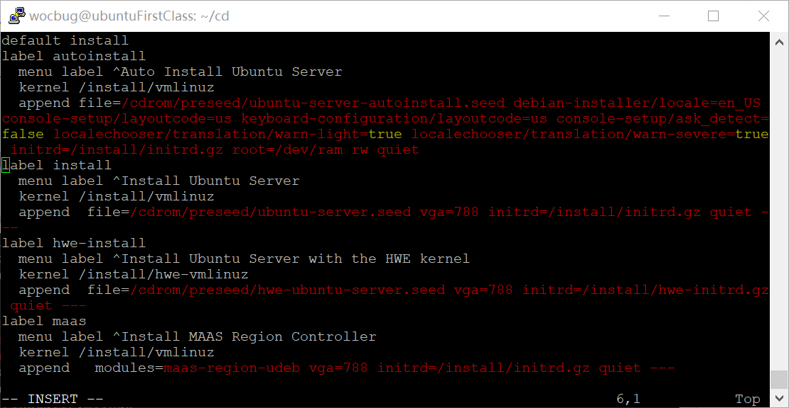

10. 修改配置缩短超时等待时间 

```bash
sudo vi isolinux/isolinux.cfg
```

11. 修改timeout为10

```bash
timeout 10
```

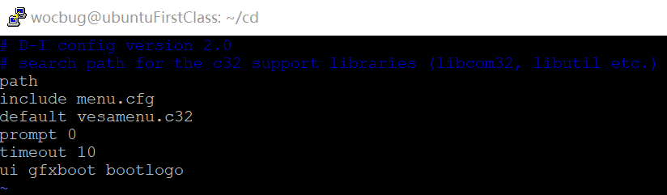

12. 提前阅读并编辑定制Ubuntu官方提供的示例[preseed.cfg](https://help.ubuntu.com/lts/installation-guide/example-preseed.txt)，并将该文件保存到刚才创建的工作目录

``~/cd/preseed/ubuntu-server-autoinstall.seed``

通过修改presseed.cfg文件，另存为ubuntu-server-autoinstall.seed文件，使用UltraISO将其放入ISO的presseed目录下，然后再打包为ISO文件。

13.  重新生成md5sum.txt
    cd ~/cd && find . -type f -print0 | xargs -0 md5sum > md5sum.txt

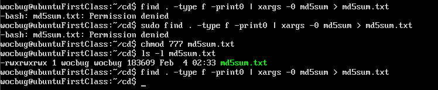

14.

```
#封闭改动后的目录到.iso
IMAGE=custom.iso
BUILD=~/cd/

mkisofs -r -V "Custom Ubuntu Install CD" \
            -cache-inodes \
            -J -l -b isolinux/isolinux.bin \
            -c isolinux/boot.cat -no-emul-boot \
            -boot-load-size 4 -boot-info-table \
            -o $IMAGE $BUILD

#如果目标磁盘之前有数据，则在安装过程中会在分区检测环节出现人机交互对话框需要人工选择
```

报错：

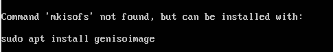

安装genisoimage

```bash
apt-get update
apt-get install genisoimage
```

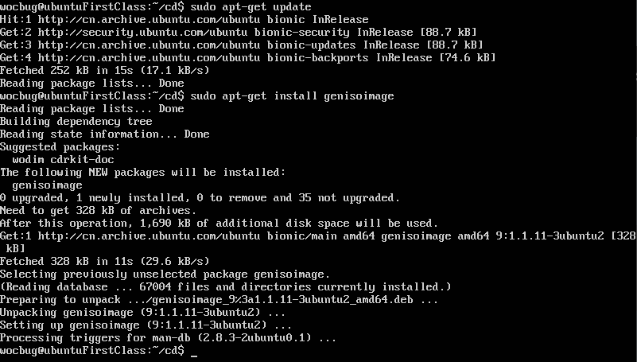

再使用mkisofs命令：

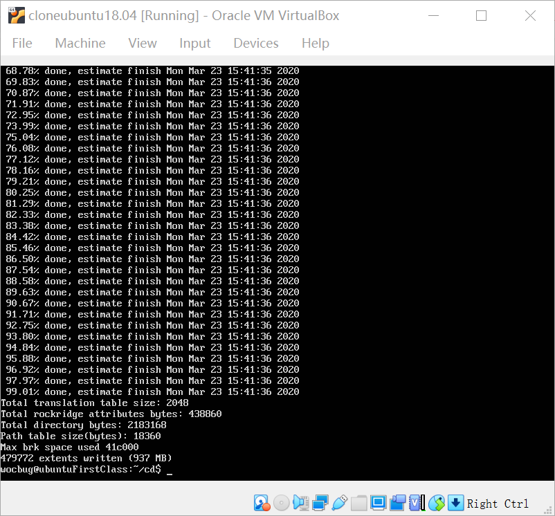

15. mv custom.iso ../

16. 打开psftp窗口，输入get custom.iso

    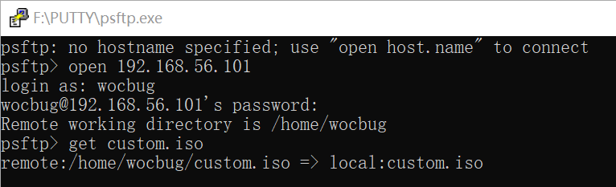

17.将文件拷贝到当前目录

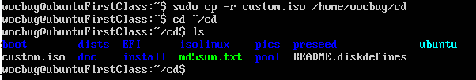

18. 激动人心的无人值守时刻到了！果然，第一遍失败了...

    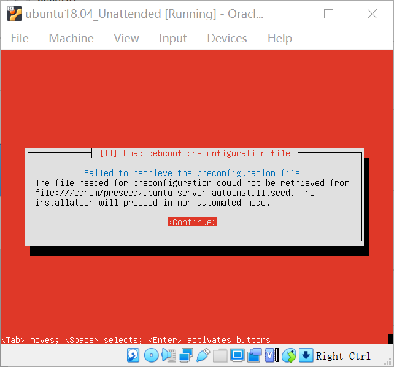

发现是ubuntu-server-autoinstall.seed文件放错位置了，修改后成功！！~~终于啊我的老天爷啊！~~

**视频**：
（mp4格式视频无法显示，gif视频格式太大无法push，使用git-lfs传输大文件又显示超过额定容量，只好十倍速视频压缩在100M以下了）


安装时长：12分钟
视频时长：1分40秒

---
### 4. preseed文件比对

**比对结果**：https://www.diffchecker.com/y0KstW5Z
官方文本|老师提供|作用
---|---|---
for stretch|for xenial|支持版本不同，xenial是16.04版
 #d-i localechooser/supported-locales multiselect en_US.UTF-8, zh_CN.UTF-8 | d-i localechooser/supported-locales multiselect en_US.UTF-8, zh_CN.UTF-8<br>d-i pkgsel/install-language-support boolean false|安装字符集（语言、地区、编码），跳过语言支持问题
 #d-i netcfg/link_wait_timeout string 10|d-i netcfg/link_wait_timeout string 5|设定链路检测等待超时时长为5秒
 #d-i netcfg/dhcp_timeout string 60|d-i netcfg/dhcp_timeout string 5|设定dhcp服务等待超时事件为5秒
 #d-i netcfg/disable_autoconfig boolean true|d-i netcfg/disable_autoconfig boolean true|设置手动配置网络
 IPv4 example<br>#d-i netcfg/get_ipaddress string 192.168.1.42<br>#d-i netcfg/get_netmask string 255.255.255.0<br>#d-i netcfg/get_gateway string 192.168.1.1<br>#d-i netcfg/get_nameservers string 192.168.1.1<br>#d-i netcfg/confirm_static boolean true|IPv4 example<br>d-i netcfg/get_ipaddress string 192.168.138.42<br>d-i netcfg/get_netmask string 255.255.255.0<br>d-i netcfg/get_gateway string 192.168.138.1<br>d-i netcfg/get_nameservers string 192.168.138.1<br>d-i netcfg/confirm_static boolean true|配置ip地址、网络掩码、网关、域名解析服务器
 d-i netcfg/get_hostname string unassigned-hostname<br>d-i netcfg/get_domain string unassigned-domain|d-i netcfg/get_hostname string svr.sec.cuc.edu.cn<br>d-i netcfg/get_domain string dns.sec.cuc.edu.cn|设置主机名、域名
 #d-i netcfg/hostname string somehost|d-i netcfg/hostname string isc-vm-host|设置主机名
 #d-i mirror/suite string stretch<br>#d-i mirror/udeb/suite string stretch|d-i mirror/suite string xenial<br>d-i mirror/udeb/suite string xenial|设置要安装的套件
 #d-i passwd/user-fullname string Ubuntu User<br>#d-i passwd/username string ubuntu<br>#d-i passwd/user-password password insecure<br>#d-i passwd/user-password-again password insecure|d-i passwd/user-fullname string cuc<br>d-i passwd/username string cuc<br>d-i passwd/user-password password sec.cuc.edu.cn<br>d-i passwd/user-password-again password sec.cuc.edu.cn|创建普通用户，并设置用户名密码
 d-i time/zone string US/Eastern|d-i time/zone string Asia/Shanghai|设置时区
 #d-i partman-auto/init_automatically_partition select biggest_free|d-i partman-auto/init_automatically_partition select biggest_free|初始化分区选择最大
 #d-i partman-auto-lvm/guided_size string max|d-i partman-auto-lvm/guided_size string max|LVM分区选择最大
 d-i partman-auto/choose_recipe select atomic|d-i partman-auto/choose_recipe select multi|选择分区方式为multi
 #d-i apt-setup/use_mirror boolean false|d-i apt-setup/use_mirror boolean false|不使用网络镜像tasksel tasksel/first multiselect ubuntu-desktop|tasksel tasksel/first multiselect server|选择安装版本
 #d-i pkgsel/include string openssh-server build-essential|d-i pkgsel/include string openssh-server|安装openssh-server
 #d-i pkgsel/upgrade select none|d-i pkgsel/upgrade select none|禁止自动升级
 d-i pkgsel/update-policy select none|d-i pkgsel/update-policy select unattended-upgrades|pkgsel包更新策略选择无人值守升级


## 参考资料

1. [关于Ubuntu的ssh免密登录](https://www.cnblogs.com/huxinga/p/6418790.html )

2. [ubuntu配置免密登录、直接操作其他设备](https://blog.csdn.net/baidu_36943075/article/details/90927629)

3. [项目：ssh免密远程登录搭建（一）](https://www.cnblogs.com/creater-wei/p/9859098.html)


4.  [揭大佬作业参考](https://github.com/20LinuxManagement/assignment-01-YanhuiJessica/tree/master/assignment-0x01)


5. [作业参考2](https://github.com/CUCCS/linux-2019-cloud0606/blob/lab1/lab1/实验报告.md)

6. [作业参考3](https://github.com/CUCCS/linux-2019-cloud0606/blob/lab1/lab1/实验报告.md)

7. [无人值守Linux安装镜像制作](https://blog.csdn.net/qq_31989521/article/details/58600426)

