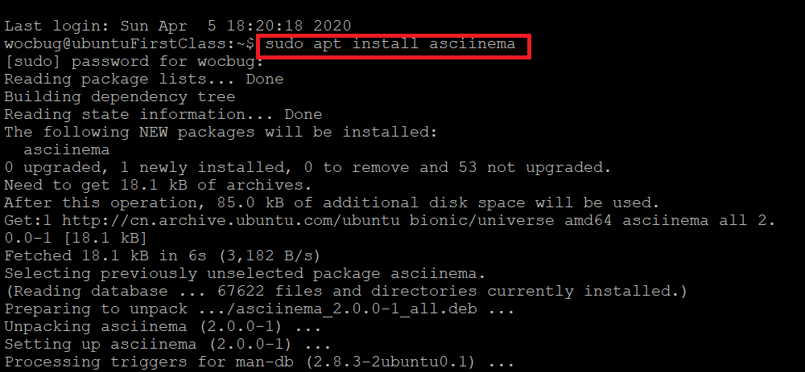
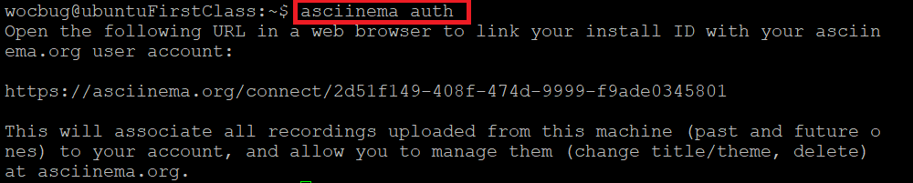
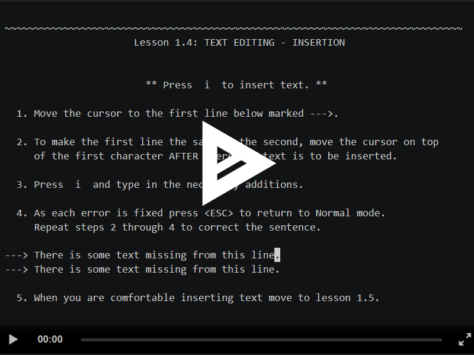
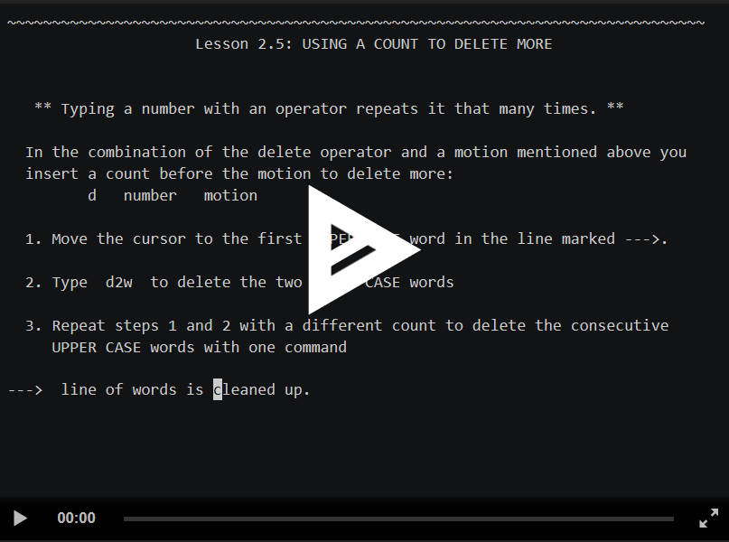
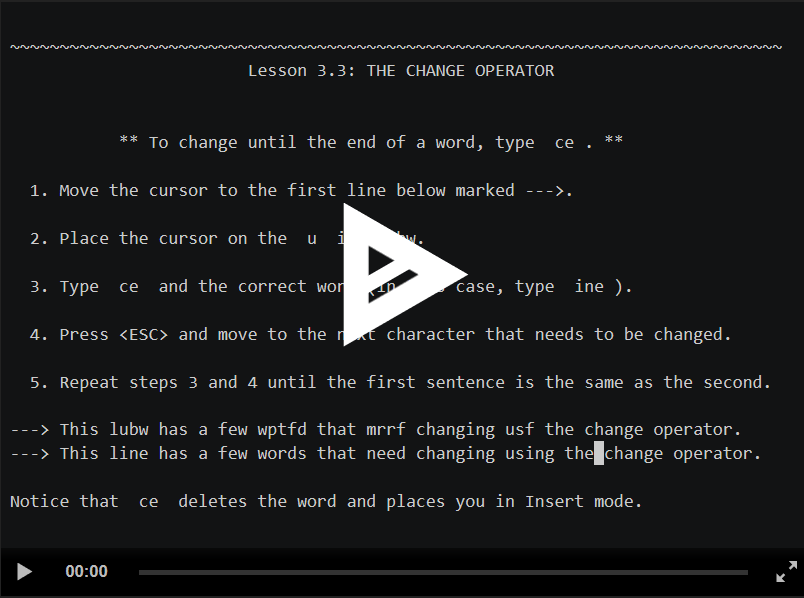
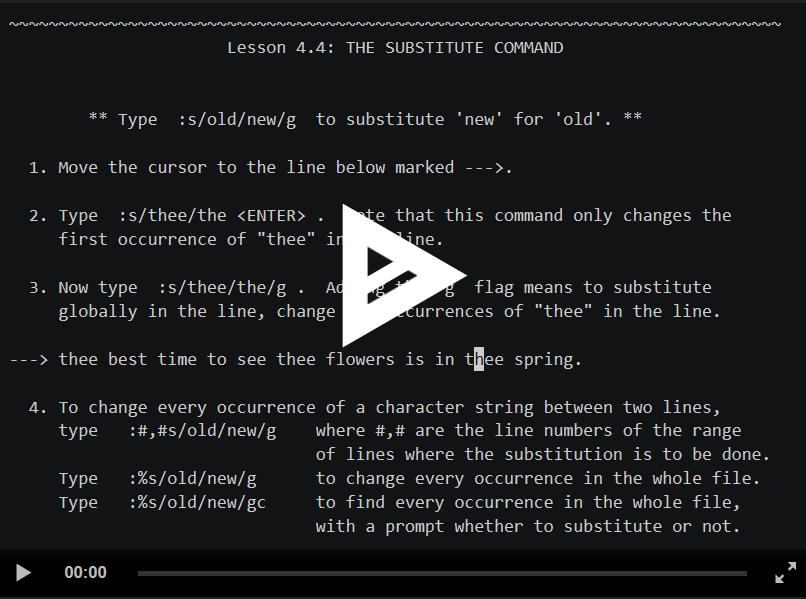
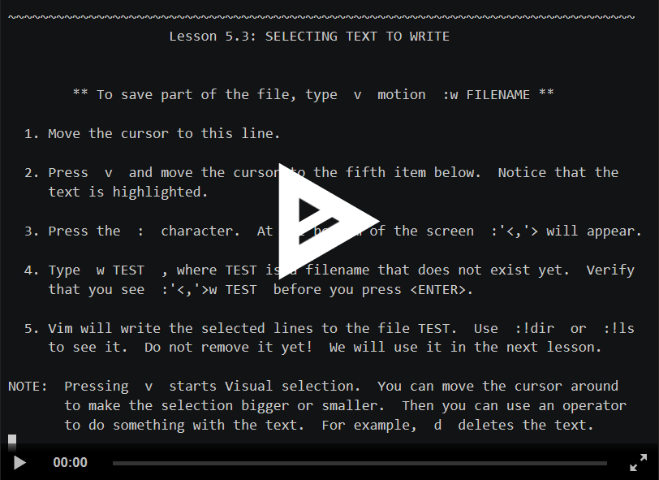
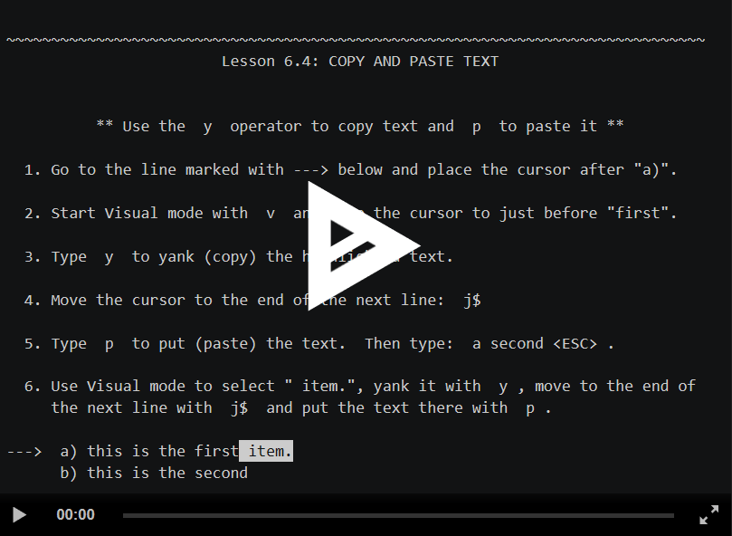

[TOC]

# 学习vimtutor

---
## 实验环境
* Ubuntu 18.04 Server 64bit

---

## 实验要求
* 在asciinema注册一个账号，并在本地安装配置好asciinema
* 确保本地已经完成asciinema auth，并在asciinema成功关联了本地账号和在线账号
* 上传本人亲自动手完成的vimtutor操作全程录像
* 在自己的github仓库上新建markdown格式纯文本文件附上asciinema的分享URL
* 提醒：避免在终端操作录像过程中暴漏密码、个人隐私等任何机密数据

---

## 实验步骤
1. 注册asciinema，并在本地配置
   
   

2. 用asciinema录制vimtutor过程
   
  **Lesson 1**

  

  **Lesson 2**

  

  **Lesson 3**

  

  **Lesson 4**

  

  **Lesson 5**

  

  **Lesson 6**

  

  **Lesson 7**

  

---

## 自查清单

* **你了解vim有哪几种工作模式？**

  1. 命令模式(command-mode)：操作文件
  2. 插入模式(insert-mode)：在文本中插入内容
  3. 可视模式(visual-mode)：通过v进入，可选区文本
  4. 正常模式(normal-mode)：浏览、修改文本等
  5. 选择模式(Select-mode)：在visual模式下``Ctrl+G``进入和退出模式，直接输入文字会进入inster模式并替换内容
  6. EX模式(Ex-mode)：``ex``进入，``:vi``离开
  7. 命令行模式(Command line mode)：``\``,``?``,``!``,``:``等

  

* **Normal模式下，从当前行开始，一次向下移动光标10行的操作方法？如何快速移动到文件开始行和结束行？如何快速跳转到文件中的第N行？**

  1. 向下移动光标10行：``10j``

  2. 移动到文件开始行：``1G/gg``

  3. 移动到文件结束行：``G``

  4. 跳转到文件第N行：``NG/Ngg``

     

* **Normal模式下，如何删除单个字符、单个单词、从当前光标位置一直删除到行尾、单行、当前行开始向下数N行？**

  1. 删除单个字符：``x/dl``
   
  2. 删除单个单词：
     1. ``dw``：光标落在单词第一个字母，删当前单词
     2. ``de``：光标落在单词第一个字母及之前，删后一个单词
     3. ``daw``：光标落在单词最后一个字母及之前，删当前单词/空白后的单词
     4. ``db``：光标落在单词最后一个字母之后，删前一个单词

  3. 从光标位置一直删除到行尾：``d$/D``

  4. 删除单行：``dd``

  5. 删除当前行开始向下数N行：``Ndd``

* **如何在vim中快速插入N个空行？如何在vim中快速输入80个-？**

  1. 插入N个空行：
     1. 向下插入：``No``
     2. 向上插入：``NO``
     ``ESC``
  2. 输入80个-：
     ``80i/a-``
     ``ESC``

     

* **如何撤销最近一次编辑操作？如何重做最近一次被撤销的操作？**

  1. 撤销最近一次编辑操作：``u``

  2. 重做最近一次倍撤销的操作：``Ctrl+R``

     

* **vim中如何实现剪切粘贴单个字符？单个单词？单行？如何实现相似的复制粘贴操作呢？**

  1. 剪切粘贴单个字符：

     ``x``

     `` p``

  2. 剪切粘贴单个单词：

     ``dw``

     ``p``

  3. 剪切粘贴单行：

     ``d$/D``

     ``p``

  4. 实现相似的复制粘贴操作：

     ``v进入可视模式,移动对文本进行选中``

     ``y复制``

     ``p粘贴``
  5. 从vim向系统粘贴复制的内容：
    在vim中``+y``，在其他应用程序中粘贴

---

* **为了编辑一段文本你能想到哪几种操作方式（按键序列）？**

  1. ``a``键在光标后插入内容，A在行尾插入内容

  2. ``ce``、``cw``、``c$``删除单词/行以更改内容

  3. ``dd``、``dw``、``d$``删除行/单词/光标到行末

  4. ``G``移动至文件尾，``gg``移动至文件首，``Ctrl+G``查看行号，``<行号>+shift+G``跳转行号

  5. ``i``键进入插入模式

  6. ``O``键在光标上方打开新的一行进入插入模式，``o``键在光标下方打开新的一行进入插入模式

  7. ``r``替换文字

  8. ``u``撤销操作，``U``恢复某行原始状态，``Ctrl+R``撤销刚才的撤销操作

  9. ``v``进入可视模式，``y``复制，``p``粘贴

  10. ``x``删除文字

  11. ``/<word>`` + ``n``键 可查找单词

      

* **查看当前正在编辑的文件名的方法？查看当前光标所在行的行号的方法？**

  ``Ctrl+G``

  

* **在文件中进行关键词搜索你会哪些方法？如何设置忽略大小写的情况下进行匹配搜索？如何将匹配的搜索结果进行高亮显示？如何对匹配到的关键词进行批量替换？**

  1. 关键词搜索：
     1. ``\word`` 用``n``向后搜索，``N``向前搜索
     2. ``?word`` 用``n``向前搜索，``N``向后搜索

  2. 设置忽略大小写的情况下进行匹配搜索：

     ``:set ic``

  3. 将匹配的搜索结果进行高亮显示：

     ``:set hls``

  4. 对匹配到的关键词进行批量替换：

     `` :s/old/new ``在一行内替换头一个字符串 old 为新的字符串 new

     ``:s/old/new/g`` 在一行内替换所有的字符串 old 为新的字符串 new

     ``:#,#s/old/new/g``替换两行之间的关键词

     ``:%s/old/new/g``在文件内替换所有的字符串 old 为新的字符串 new

     ``:%s/old/new/gc``进行全文替换时询问用户确认每个替换

  

* **在文件中最近编辑过的位置来回快速跳转的方法？**

  1. ``Ctrl+O``向前跳转

  2. ``Ctrl+I``向后跳转

     

* **如何把光标定位到各种括号的匹配项？例如：找到(, [, or {对应匹配的),], or }**

  光标位于(,[,{时，键入``%``，再按``%``可跳回

  

* **在不退出vim的情况下执行一个外部程序的方法？**

  ``:!<command>``

  

* **如何使用vim的内置帮助系统来查询一个内置默认快捷键的使用方法？如何在两个不同的分屏窗口中移动光标？**

  1. 查询一个内置默认快捷键的使用方法：
     1. ``:help <shortcut>``查询normal模式下的快捷键
     2. ``:help i_<shortcut>``查询insert模式下的快捷键
     3. ``:help c_<shortcut>``查询command-line模式下的快捷键
     4. ``:help v_<shortcut>``查询Visual模式下的快捷键
  2. 在两个不同的分屏窗口中移动光标：``(Ctrl+W)+W``

---

## 参考资料

* [vim学习笔记——vimtutor](https://www.jianshu.com/p/dbd02f28bc0c)

* [From GUI to CLI实验报告](https://github.com/CUCCS/linux-2020-ZXMMD/blob/chap0x02/chap0x02/chap0x02.md)

* [vimtutor实验报告](https://github.com/CUCCS/linux-2020-chococolate/blob/chap0x02/chap0x02/chapter%2000x02.md)