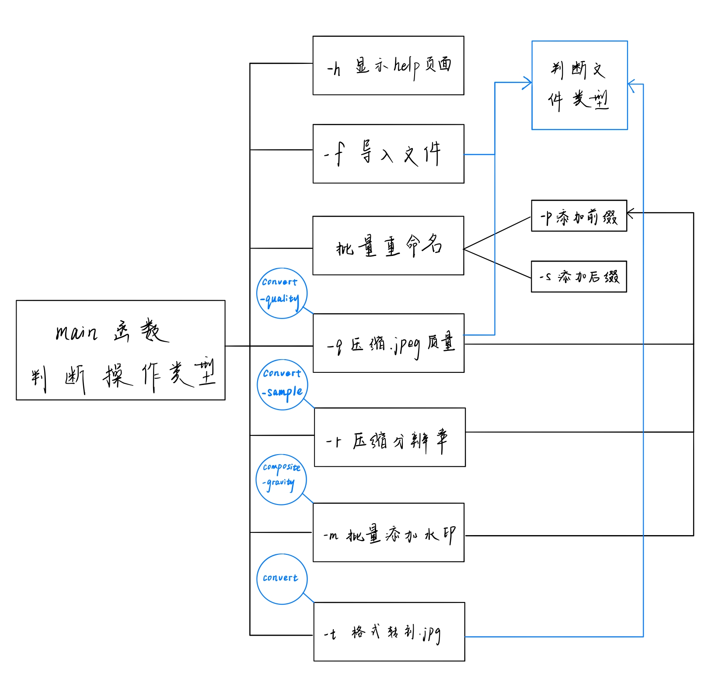
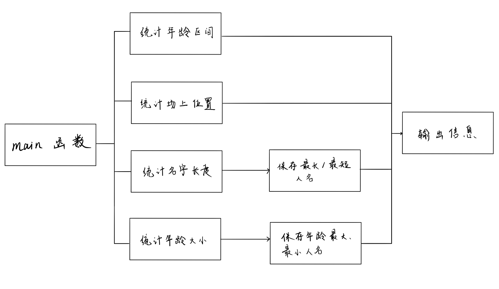
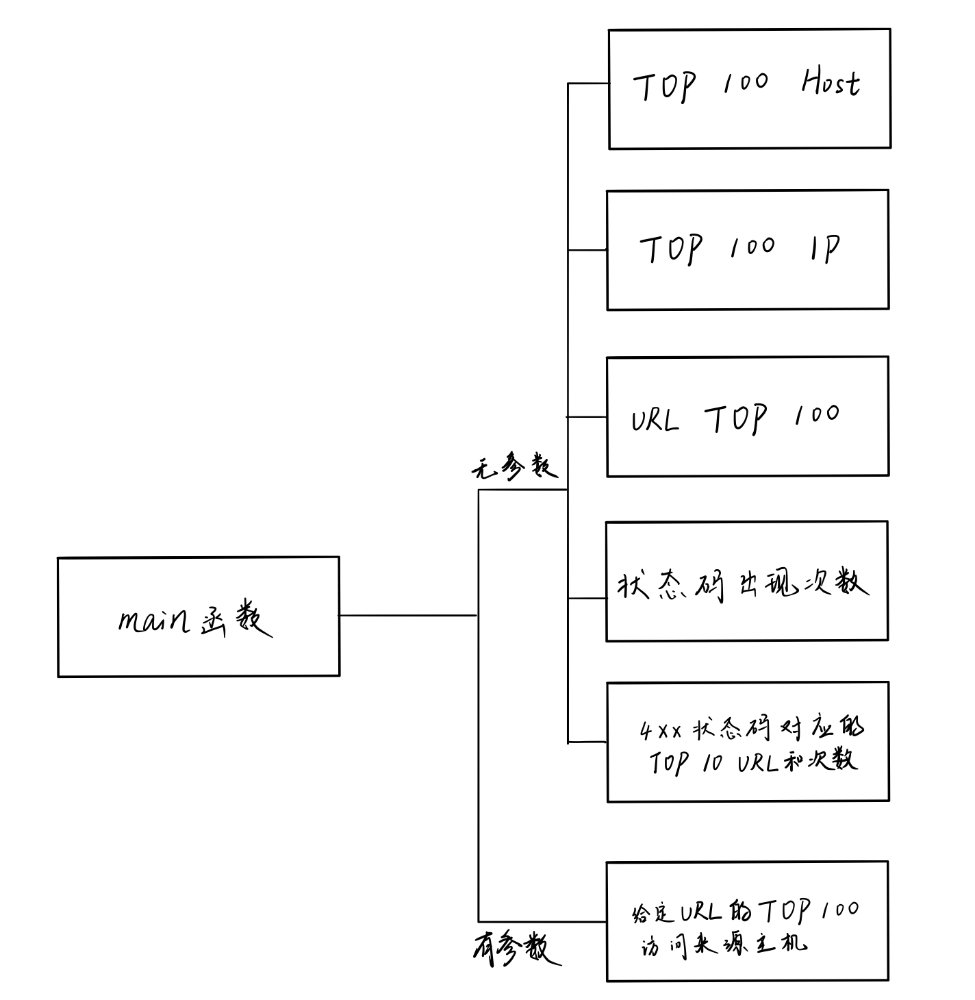

## 第四章实验报告

任务一：用bash编写一个脚本，实现以下功能：

- √ 支持命令行参数方式使用不同功能
- √ 支持对指定目录下所有支持格式的图片文件进行批处理
- √ 支持以下常见图片批处理功能的单独使用或组合使用
  - √ 支持对jpeg格式图片进行图片质量压缩
  - √ 支持对jpeg/png/svg格式图片在保持原始宽高比的前提下压缩分辨率
  - √ 支持对图片批量添加自定义文本水印
  - √ 支持批量重命名（统一添加文件名前缀或后缀，不影响原始文件扩展名）
  - √ 支持将png/svg图片统一转换为jpg格式图片

未解决问题：组合操作无法改变循序，必须先输入-f才能识别-q,-r,-p,-s操作

---

* 任务二：用bash编写一个文本批处理脚本，对以下附件分别进行批量处理完成相应的数据统计任务：
  * [2014世界杯运动员数据](exp/chap0x04/worldcupplayerinfo.tsv)
    * √统计不同年龄区间范围（20岁以下、[20-30]、30岁以上）的球员**数量**、**百分比**
    * √统计不同场上位置的球员**数量**、**百分比**
    * √名字最长的球员是谁？名字最短的球员是谁？
    * √年龄最大的球员是谁？年龄最小的球员是谁？
  
  

---

* 任务三：用bash编写一个文本批处理脚本，对以下附件分别进行批量处理完成相应的数据统计任务：
  * [Web服务器访问日志](exp/chap0x04/web_log.tsv.7z)
    * √统计访问来源主机TOP 100和分别对应出现的总次数
    * √统计访问来源主机TOP 100 IP和分别对应出现的总次数
    * √统计最频繁被访问的URL TOP 100
    * √统计不同响应状态码的出现次数和对应百分比
    * √分别统计不同4XX状态码对应的TOP 10 URL和对应出现的总次数
    * √给定URL输出TOP 100访问来源主机
  
  

  暂未完成：
    1. 只支持-操作，暂不支持--操作
    2. task2和task3的help信息

### 参考文献

[ImageMagick中文站](http://www.imagemagick.com.cn/commands.html)

[shell if判断语句参数](https://www.cnblogs.com/qiuhong10/p/7928821.html)

[linux-2019-TheMasterOfMagic](https://github.com/CUCCS/linux-2019-TheMasterOfMagic/tree/master/chap0x04)

[linux-2019-DcmTruman](https://github.com/CUCCS/linux-2019-DcmTruman/tree/0x04)

[shell十三问](http://bbs.chinaunix.net/thread-218853-1-1.html)

[awk引用shell中变量的几种方法](https://blog.csdn.net/u012906135/article/details/48469011)

[awk与sort妙用](https://blog.csdn.net/jakejohn/article/details/79825272)

[正则表达式 - 语法](https://www.runoob.com/regexp/regexp-syntax.html)

