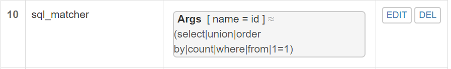

# 实验环境

ubuntu 18.04.4

Host-Only IP：192.168.56.101

---

# 实验完成度

## Part 1 基本要求

* √ 安装Nginx
* √ 安装VeryNginx
* √ 安装配置Wordpress
* √ DVWA
* × 启用https

## Part 2 安全加固要求
* √ 使用IP地址方式均无法访问上述任意站点，并向访客展示自定义的友好错误提示信息页面-1
* √ Damn Vulnerable Web Application (DVWA)只允许白名单上的访客来源IP，其他来源的IP访问均向访客展示自定义的友好错误提示信息页面-2
* √ 在不升级Wordpress版本的情况下，通过定制VeryNginx的访问控制策略规则，热修复WordPress < 4.7.1 - Username Enumeration
* √ 通过配置VeryNginx的Filter规则实现对Damn Vulnerable Web Application (DVWA)的SQL注入实验在低安全等级条件下进行防护

## Part 3 VeryNginx配置要求
* √ VeryNginx的Web管理页面仅允许白名单上的访客来源IP，其他来源的IP访问均向访客展示自定义的友好错误提示信息页面-3
* × 通过定制VeryNginx的访问控制策略规则实现：
  * 限制DVWA站点的单IP访问速率为每秒请求数 < 50
  *  限制Wordpress站点的单IP访问速率为每秒请求数 < 20
  *  超过访问频率限制的请求直接返回自定义错误提示信息页面-4
  * 禁止curl访问

---


# 实验步骤

配置本地host文件，路径在C:\Windows\System32\drivers\etc


## 一、基本要求

### 在一台主机（虚拟机）上同时配置[Nginx](http://nginx.org/)和[VeryNginx](https://github.com/alexazhou/VeryNginx)

- VeryNginx作为本次实验的Web App的反向代理服务器和WAF
- PHP-FPM进程的反向代理配置在nginx服务器上，VeryNginx服务器不直接配置Web站点服务

```bash
## 安装nginx
sudo apt-get update
sudo apt-get install nginx -y

## 安装verynginx
sudo nginx -s stop
sudo apt install -y libpcre3-dev libssl1.0-dev zlib1g-dev python3 unzip gcc make
wget https://github.com/alexazhou/VeryNginx/archive/master.zip
unzip master.zip		# 解压
cd VeryNginx-master/
sed -i "2s/nginx/www-data/" nginx.conf
python3 install.py install		# 安装
ln -s /opt/verynginx/openresty/nginx/sbin/nginx /usr/sbin/verynginx		# 创建软链接便于启动
verynginx -t	# 检查配置文件是否正确
verynginx		# 启动verynginx
```

安装成功


---

### 安装Wordpress

```bash
# WordPress需要用到数据库，所以我们要用mysql创建WordPress所需要的库
# 下载安装mysql和php7.2相关软件
sudo apt install -y mysql-server php7.2-fpm php7.2-mysql php7.2-gd
# 安装完成后进入root用户
# mysql root 用户默认没有密码
sudo mysql -u root -p
# 进入mysql后之后，创建WordPress使用的数据库

mysql> CREATE USER 'wordpress'@'localhost' IDENTIFIED BY 'wordpress';
mysql> CREATE DATABASE wp_db;
mysql> GRANT ALL ON wp_db.* TO 'wordpress'@'localhost';
# 指定WorePress目录
WP_PATH=/var/www/wordpress
# 创建该目录下的public文件夹
sudo mkdir -p ${WP_PATH}/public/
# 修改该文件下的所有者为www-data
sudo chown -R www-data:www-data ${WP_PATH}/public
# 下载并解压WorePress
wget https://wordpress.org/wordpress-4.7.zip
unzip wordpress-4.7.zip
# 将wordpress文件全部拷贝刚才的public中
sudo cp -r wordpress/* ${WP_PATH}/public/
cd ${WP_PATH}/public/
```

```bash
# 拷贝配置文件
sudo cp wp-config-sample.php wp-config.php
# 修改wp-config.php文件中的`database_name_here`,`username_here`和`password_here`字段为我们的数据库名称，用户名和密码。使wordpress能够访问mysql。

```


```
sudo sed -i s/database_name_here/wordpress_db/ wp-config.php
sudo sed -i s/username_here/wordpress/ wp-config.php
sudo sed -i s/password_here/wordpress/ wp-config.php
```


---

### 连接WordPress与Nginx

```bash
# 新建配置文件，设置端口8080和文件名wp.sec.cuc.edu.cn
WP_DOMAIN=wp.sec.cuc.edu.cn
WP_PORT=8080
sudo tee /etc/nginx/sites-available/${WP_DOMAIN} << EOF
server {
    listen localhost:${WP_PORT};
    server_name ${WP_DOMAIN};

    root ${WP_PATH}/public;
    index index.php;

    location / {
        try_files \$uri \$uri/ /index.php?\$args;
    }

    location ~ \.php\$ {
        include snippets/fastcgi-php.conf;
        fastcgi_pass unix:/run/php/php7.2-fpm.sock;
    }
}
EOF
# 在sites-enabled中创建sites-available的软链接，并删除default
sudo ln -s /etc/nginx/sites-available/${WP_DOMAIN} /etc/nginx/sites-enabled/
sudo rm /etc/nginx/sites-enabled/default
# 启动nginx
sudo nginx
```

---

### 配置VeryNginx访问wp.sec.cuc.edu.cn

添加Request Matcher


**添加Up Stream和Proxy Pass**：


**这里保存不成功的解决方法**：

用 chmod -R 777 /opt/verynginx/verynginx/configs改变权限

**页面加载成功**：


初始化信息：


基础网页：


---


### 安装Dvwa并配置VeryNginx

与WordPress步骤类似

```
# 指定目录，更改所有者
DVWA_PATH=/var/www/dvwa
sudo mkdir -p ${DVWA_PATH}/public/
sudo chown -R www-data:www-data ${DVWA_PATH}/public

# 下载解压
wget https://github.com/ethicalhack3r/DVWA/archive/master.zip
unzip master.zip
# 拷贝文件到/var/www/dvwa下
sudo cp -r DVWA-master/* ${DVWA_PATH}/public/
cd ${DVWA_PATH}/public/
sudo cp config/config.inc.php.dist config/config.inc.php
# 配置文件,8000端口
DVWA_DOMAIN=dvwa.sec.cuc.edu.cn
DVWA_PORT=8000
sudo tee /etc/nginx/sites-available/${DVWA_DOMAIN} << EOF
server {
    listen localhost:${DVWA_PORT};
    server_name ${DVWA_DOMAIN};

    root ${DVWA_PATH}/public;
    index index.php;

    location / {
        try_files \$uri \$uri/ /index.php?\$args;
    }

    location ~ \.php\$ {
        include snippets/fastcgi-php.conf;
        fastcgi_pass unix:/run/php/php7.2-fpm.sock;
    }
}
EOF
# 设置软链接
sudo ln -s /etc/nginx/sites-available/${DVWA_DOMAIN} /etc/nginx/sites-enabled/
# 重新载入配置
sudo nginx -s reload
```

和之前的步骤类似：


页面加载成功：


---


### WordPress启用HTTPS

本实验中，localhost网站使用的证书和verynginx对外使用的证书，我使用的是tsyitc

```
# 生成自签名证书
sudo openssl req -x509 -newkey rsa:4096 -nodes -subj "/C=CN/ST=Beijing/L=Beijing/O=CUC/OU=SEC/CN=wp.sec.cuc.edu.cn" -keyout key.pem -out cert.pem -days 365
# 将生成的cert.pem和key.pem放在/etc/nginx目录下
sudo mv cert.pem /etc/nginx/
sudo mv key.pem /etc/nginx/
# 修改/etc/nginx/sites-available/wp.sec.cuc.edu.cn 中的8080端口为”8443 ssl"
sudo sed -i "2s/8080/8443\ ssl" wp.sec.cuc.edu.cn
# 在第二行后添加cert.pem和key.pem
sudo sed -i '2a ssl_certificate      /etc/nginx/cert.pem;\nssl_certificate_key  /etc/nginx/key.pem;' wp.sec.cuc.edu.cn
```

在`/opt/verynginx/openresty/nginx/conf/nginx.conf`中修改server块，使verynginx监听443端口

```
server {
    listen 80;
    listen 443 ssl;
    ssl_certificate      /etc/nginx/cert.pem;
    ssl_certificate_key  /etc/nginx/key.pem;

    #this line shoud be include in every server block
    include /opt/verynginx/verynginx/nginx_conf/in_server_block.conf;

    location = / {
        root   html;
        index  index.html index.htm;
    }
}
```

重新加载配置文件

```
sudo nginx -s reload
sudo verynginx -s reload
```

---


## 安全加固

### 使用IP地址方式均无法访问上述任意站点，并向访客展示自定义的友好错误提示信息页面-1

添加`Matcher`规则


添加`Response`相应


添加`Filter`


此时以ip形式访问，会出现对应的提示并拒绝


---


### Damn Vulnerable Web Application (DVWA)只允许白名单上的访客来源IP，其他来源的IP访问均向访客展示自定义的友好错误提示信息页面-2

上一步操作【我杀我自己】，把自己给踢出去了。

将/opt/verynginx/verynginx/configs/config.json的这里改成false即可：


添加`Matcher`


添加`Response`


添加`Filter`


在白名单的客户端访问


不在白名单的客户端访问


---


### 在不升级Wordpress版本的情况下，通过定制VeryNginx的访问控制策略规则，热修复WordPress < 4.7.1 - Username Enumeration

添加`Matcher`


添加`Filter`,报错信息为404，无需添加response


效果：


---


### 通过配置VeryNginx的Filter规则实现对Damn Vulnerable Web Application (DVWA)的SQL注入实验在低安全等级条件下进行防护

我们可以只简单过滤一下提交参数（毕竟低等级）




---


## Part 3 VERYNGINX配置要求

### VeryNginx的Web管理页面仅允许白名单上的访客来源IP，其他来源的IP访问均向访客展示自定义的友好错误提示信息页面-3

与其他两个类似

添加`Matcher`


添加`Response`


添加`Filter`


白名单访问


非白名单访问


---


### 限制DVWA站点的单IP访问速率为每秒请求数 < 50, 限制Wordpress站点的单IP访问速率为每秒请求数 < 20, 超过访问频率限制的请求直接返回自定义错误提示信息页面-4

添加`Response`


添加`Frequency Limit`


进行压测，然而不知道是什么原因，并没有被限制，依旧跑通了，尚未解决。


# 参考文献

1. [linux-2019-DcmTruman/0x05/实验报告.md](https://github.com/CUCCS/linux-2019-DcmTruman/blob/0x05/0x05/实验报告.md)
2. [linux-2019-TheMasterOfMagic/chap0x05/](https://github.com/CUCCS/linux-2019-TheMasterOfMagic/tree/master/chap0x05)