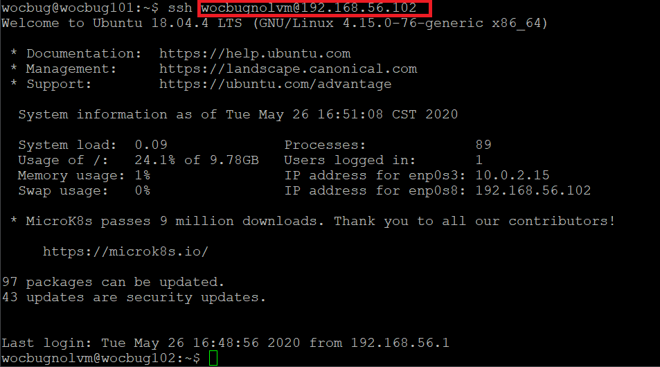
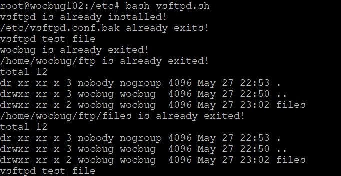
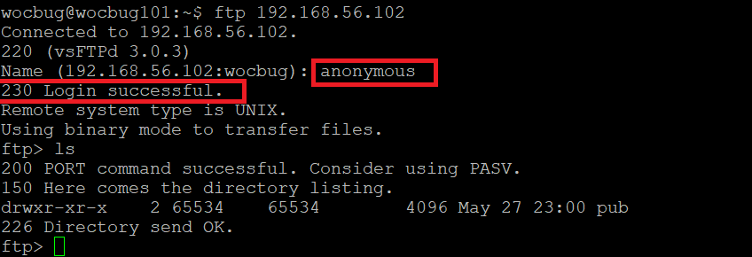

# shell脚本编程练习进阶

## 实验环境

Ubuntu 18.04 Server 64bit

工作主机host only：192.168.56.101

目标主机host only：192.168.56.102

## 实验步骤

### 0、配置免密登录

``ssh-keygen -t rsa``

``ssh-copy-id -i ~/.ssh/id_rsa.pub wocbugnolvm@192.168.56.102``

### 一、FTP

ftp服务器软件选用vsftpd

-  配置一个提供匿名访问的FTP服务器，匿名访问者可以访问1个目录且仅拥有该目录及其所有子目录的只读访问权限；

远程登录到目的主机，拷贝并运行vsftpd.sh文件，进行vsftpd的安装和配置。

我这里由于多次调试，所以显示文件已存在。

退回到工作主机进行匿名登录：

-  配置一个支持用户名和密码方式访问的账号，该账号继承匿名访问者所有权限，且拥有对另1个独立目录及其子目录完整读写（包括创建目录、修改文件、删除文件等）权限；
  - 该账号仅可用于FTP服务访问，不能用于系统shell登录；

## 参考文献

3. [鸟哥的Linux 私房菜-- vsFTPd 文件服务器](http://cn.linux.vbird.org/linux_server/0410vsftpd/0410vsftpd-centos4.php)
2. [关于Linux环境下安装配置vsftpd服务全攻略（踩坑）](https://blog.csdn.net/aiynmimi/article/details/77012507)
3. [实验报告1](https://github.com/CUCCS/2015-linux-public-JuliBeacon/blob/exp6/%E5%AE%9E%E9%AA%8C%206/%E5%AE%9E%E9%AA%8C6.md)
4. [实验报告2](https://github.com/CUCCS/2015-linux-public-songyawen/blob/master/exp6/SHELL%E8%84%9A%E6%9C%AC%E7%BC%96%E7%A8%8B%E7%BB%83%E4%B9%A0%E8%BF%9B%E9%98%B6%EF%BC%88%E5%AE%9E%E9%AA%8C%EF%BC%89.md)
5. [实验报告3](https://github.com/CUCCS/linux-2019-luyj/blob/Linux_exp0x06/Linux_exp0x06/Linux_exp0x06.md)