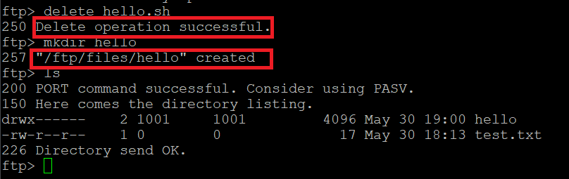

# shell脚本编程练习进阶

## 实验环境

Ubuntu 18.04 Server 64bit

工作主机host only：192.168.56.101

目标主机host only：192.168.56.102

## 实验步骤

### 0、配置免密登录

``ssh-keygen -t rsa``

``ssh-copy-id -i ~/.ssh/id_rsa.pub wocbugnolvm@192.168.56.102``

### 一、FTP

ftp服务器软件选用vsftpd

远程登录到目的主机，拷贝并运行vsftpd.sh文件，进行vsftpd的安装和配置。

我这里由于多次调试，所以显示文件已存在。

退回到工作主机进行匿名登录：

* **配置一个提供匿名访问的FTP服务器，匿名访问者可以访问1个目录且仅拥有该目录及其所有子目录的只读访问权限：**

-  **配置一个支持用户名和密码方式访问的账号，该账号继承匿名访问者所有权限，且拥有对另1个独立目录及其子目录完整读写（包括创建目录、修改文件、删除文件等）权限：**
  
  - **该账号仅可用于FTP服务访问，不能用于系统shell登录：**
  
  wocbug账号登录：
  
  
  
  
  
  成功get和put文件：
  
  
  
  
  
  test.txt被成功get到工作主机上：
  
  
  
  
  
  hello.sh被成功put到目标主机上：
  
  
  
  
  
  删除文件和创建文件夹成功：
  
  

* **FTP用户不能越权访问指定目录之外的任意其他目录和文件：**

  

  

* **匿名访问权限仅限白名单IP来源用户访问，禁止白名单IP以外的访问：**

  

  

----

### 二、NFS

在目标主机上运行nfs_s.sh：

工作主机上运行nfs_c.sh：

* **在1台Linux上配置NFS服务，另1台电脑上配置NFS客户端挂载2个权限不同的共享目录，分别对应只读访问和读写访问权限**

  

  

* **实验报告中请记录你在NFS客户端上看到的：**

  - **共享目录中文件、子目录的属主、权限信息**
  
    
  
    
  
  - **你通过NFS客户端在NFS共享目录中新建的目录、创建的文件的属主、权限信息**
  
    
  
    
  
  - **上述共享目录中文件、子目录的属主、权限信息和在NFS服务器端上查看到的信息一样吗？无论是否一致，请给出你查到的资料是如何讲解NFS目录中的属主和属主组信息应该如何正确解读**
  
    看到的信息一样。
    
    [资料1](https://www.digitalocean.com/community/tutorials/how-to-set-up-an-nfs-mount-on-ubuntu-18-04),[资料2](https://blog.51cto.com/yttitan/2406403)
    
    
    
    
    
    ---
    

### 三、DHCP

​    

## 参考文献

3. [鸟哥的Linux 私房菜-- vsFTPd 文件服务器](http://cn.linux.vbird.org/linux_server/0410vsftpd/0410vsftpd-centos4.php)
4. [关于Linux环境下安装配置vsftpd服务全攻略（踩坑）](https://blog.csdn.net/aiynmimi/article/details/77012507)
5. [NFS服务的用户身份映射](https://blog.51cto.com/yttitan/2406403)
6. [Install NFS Server and Client on Ubuntu 18.04 LTS](https://vitux.com/install-nfs-server-and-client-on-ubuntu/)
7. [How To Set Up an NFS Mount on Ubuntu 18.04](https://www.digitalocean.com/community/tutorials/how-to-set-up-an-nfs-mount-on-ubuntu-18-04)
8. [实验报告1](https://github.com/CUCCS/2015-linux-public-JuliBeacon/blob/exp6/%E5%AE%9E%E9%AA%8C%206/%E5%AE%9E%E9%AA%8C6.md)
9. [实验报告2](https://github.com/CUCCS/2015-linux-public-songyawen/blob/master/exp6/SHELL%E8%84%9A%E6%9C%AC%E7%BC%96%E7%A8%8B%E7%BB%83%E4%B9%A0%E8%BF%9B%E9%98%B6%EF%BC%88%E5%AE%9E%E9%AA%8C%EF%BC%89.md)
10. [实验报告3](https://github.com/CUCCS/linux-2019-luyj/blob/Linux_exp0x06/Linux_exp0x06/Linux_exp0x06.md)