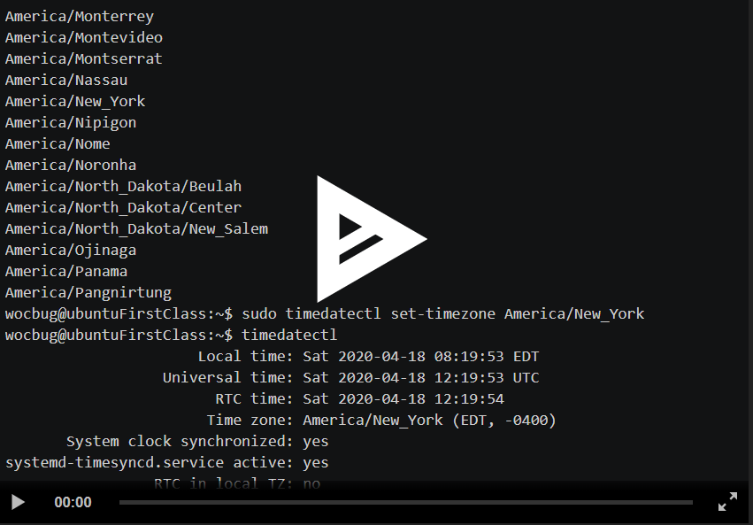
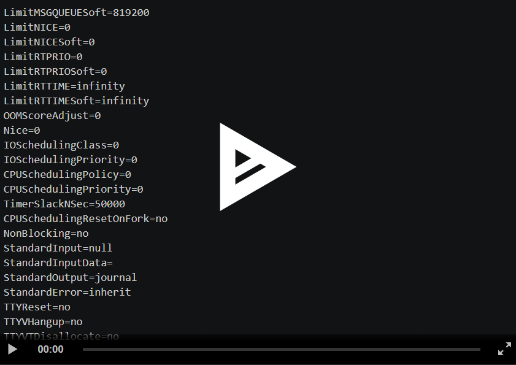
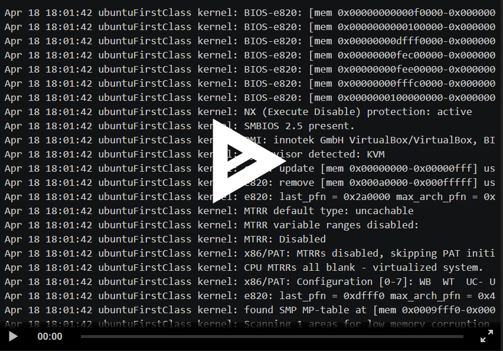

# systemd基础入门

---

## 实验环境

Ubuntu 18.04.4 Server 64bit

putty

asciinema

---

## 实验步骤

### 一、Systemd 入门教程：命令篇

### 3.1 systemctl
<details>
<summary>代码</summary>

```bash

# 重启系统
$ sudo systemctl reboot

# 关闭系统，切断电源
$ sudo systemctl poweroff

# CPU停止工作
$ sudo systemctl halt

# 暂停系统，按任意键可继续
$ sudo systemctl suspend

# 让系统进入冬眠状态，休眠到硬盘，重新打开无需登录
$ sudo systemctl hibernate

# 让系统进入交互式休眠状态，同时休眠到内存和硬盘，重新打开无需登录
$ sudo systemctl hybrid-sleep

# 启动进入救援状态（单用户状态）
$ sudo systemctl rescue
```

</details>

### Systemd 3.2-3.6 

<a href="https://asciinema.org/a/2f7ma5ZpWAr0tqGSM8AOMeoL8" target="_blank"></a>


### Systemd 4.1-4.4

<a href="https://asciinema.org/a/CQBkCCAvLOquYePbbOtOKnCna" target="_blank"></a>


### Systemd 5-7

<a href="https://asciinema.org/a/JuOc579GetzskWs0ZYsZPtS22" target="_blank">
</a>


### 二、Systemd 入门教程：实战篇


---


### 遇到问题：

1. **修改时间报错**：

   ``automatic time synchronization is enabled``

   **解决方法**：

   ``timedatectl set-ntp no``

2. ``systemctl -H user@host status xxx.service``**参数过多**：

   ``too many arguments``

   **解决方法**：

   在远程机上使用该命令

3. **reload报错**：

   ``Failed to reload atd.service: Job type reload is not applicable for unit atd.service.``

   **解决方法**：

   换一个文件

4. **问题**：

   ``CPUShares=[not set]``

   **解决办法**：选择的.service文件里没有该属性，换一个即可

   