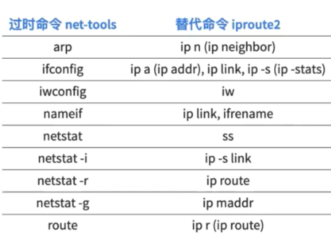

[TOC]

# 常用操作及知识点整理

## github操作
---
尖括号<>表示的是需要填写的内容

**仓库的初始化、下载、上传**
```bash
git clone <url>                 #将远程仓库拉取到本地

git init                        #在本地初始化仓库
git remote add origin <url>     #关联远程仓库的 url
git remote -v                   #查看仓库名称和url

git commit -m "<内容>"          #提交修改记录
git pull                        #拉取修改到本地
git push                        #提交修改到远程仓库
```

**仓库分支**
```bash
git branch -a                    #查看所有分支，先显示本地分支，再显示远程分支
git branch <分支名>              #创建分支
git checkout <分支名>            #切换分支
git branch -d <分支名>           #删除分支
```

**撤销错误提交**
```bash
git reflog                      #查看commit记录，复制需要退回的版本id
git reset --hard <commit_id>    #撤回到commit_id版本
```

## 计算机网络
---

**镜像**：一个磁盘上的数据在另一个磁盘上存在一个完全相同的副本。

**ssh**：远程网络传输中，一种安全传输方式或者传输协议。

**putty**：windows下连接linux的工具，直接打开后，输入要连接的linux机器的ip，用户和密码即可。

**PSFTP**：是Putty SFTP客户端，用于本地与服务器间安全传输文件（使用SSH连接）。

**Host-only**：主机模式，相当于虚拟机和宿主机通过交叉线相连，可以互访，但不能直接访问。

背景：A是本机，A1，A2是虚拟机，B是外部联网的机器
* host-only（主机模式）: A可以和A1,A2互通，A1，A2 -> B不可以，B -> A1,A2不行
* bridge（桥接模式）: A可以和A1,A2互通，A1，A2 -> B可以，B -> A1,A2可以
* nat（网络地址转换）: A可以和A1,A2互通，A1，A2 -> B可以，B -> A1,A2不行

**SSH跳板机**：为了安全并高效的管理服务器，需要通过终端连接到远程开发机进行工作，由于安全等因素，登录开发机时需要先登录跳板机，然后在跳板机上再实际连接开发机。

**shell**:
* 图形界面shell： Windows Explorer；Linux Shell；...
* 命令行式shell：cmd.exe；bash；Windows PowerShell；...

## Linux操作
---

<details>
<summary> 网络设备、版本信息 </summary>

```bash
df -h                           #以更易读的方式显示目前磁盘空间和使用情况
sudo fdisk -l                   #列出磁盘分区基本信息

ifconfig                        #显示网络设备信息
ip a                            #显示网络层地址
ip link                         #显示链路层地址
ip neigh                        #显示ipv4、ipv6的邻居节点

lsb_release -a                  #显示Linux Standard Base和特定版本的所有相关信息

bash --version                  #查看版本相关信息

arp                             #管理系统的arp缓冲区

uname -a                        #显示系统名、节点名称、操作系统发行版号、版本、运行系统的机器ID号等
```


</details>


<details>
<summary> 权限及用户管理 </summary>

```bash
adduser                         #只添加一个用户，不设置口令
useradd                         #添加用户，并为用户创建一个家目录，设置密码
addgroup                        #只添加一个用户组
groupadd                        #创建一个新的组，并添加组 ID
usermod                         #将用户添加到用户组
#e.g sudo usermod -a -G <sudo> <friend>将friend用户添加到sudo用户组中，这样friend用户就可以sudo了

echo $EUID                      #检查当前是否具备权限，若返回值为0，则说明是root用户在操作，否则就不是

id                              #显示身份和组id

su                              #直接切换用户
sudo                            #临时提升权限
sudo su -                       #提升为为root用户
#sudo只能对可执行程序提高权限，不能对bash的内置函数进行操作
exit                            #退回到普通用户
visudo                          #编辑sudo配置文件，可以通过export EDITOR=vim来改变默认打开方式为vim

sudo chown root:root <文件>      #修改文件拥有者为root和所属用户组为root

chmod 777 <文件>                 #给用户组和其他用户授予可读可写可执行权限（7表示二进制111，代表是否拥有r、e、x三个权限）
chmod +x <文件>                  #给所有用户（属主用户、用户组、其他人）添加可执行权限
chmod a+s <文件>                 #授予suid权限
chmod 7554 <文件>                
#sticky bit,用t标记替换x标记，x(小写t表示能执行，大小T表示不能执行)
#只能设置在目录上
#若该目录下的文件有w、x权限，则只有文件属主和root才有权限删除

$ ls -ld /tmp
drwxrwxrwt 8 root root 4096 Jan 20 15:26 /tmp
#d表示是个目录，t表示是个临时目录

$ ls -l /usr/bin/passwd
-rwsr-xr-x 1 root root 54256 Mar 29  2016 /usr/bin/passwd
#s表示是个suid的程序

$ ls -l /etc/shadow
-rw-r----- 1 root shadow 941 Jan 16 12:37 /etc/shadow

```
设：
``9 8 7 6 5 4 3 2 1 0``

``- r w x r - x r - x``

**第9位表示文件类型**：
b  块特殊文件（Block special file）
c  字符特殊文件（Character special file）
d  目录（Directory）
l  符号链接（Symbolic link）
s  套接字链接（Socket link）
p  命名管道（FIFO）
\- 普通文件（Regular file）

**8-6位表示文件所有者的权限**
**5-3位表示同组用户的权限**
**2-0位表示其他用户的权限**
其形式为rwx：
r表示可读，w表示可写，x表示可执行
没有权限的位置用 -表示

</details>

<details>
<summary> 进程运行状态 </summary>

```bash
ps aux    
#ps a查看所有进程
#ps u查看以用户为主的进程状态
#x一般与a连用
pstree                           #以树形列表的方式展示进程状态
pidof <文件名>                    #查看文件对应进程编号

top                              #查看系统当前运行时的负载情况
htop                             #以更直观的方式显示系统运行负载情况

kill <进程编号>                   #杀死进程
kill -9 <进程编号>                #强制杀死进程

ping <url> &                     #将进程放到后台运行
#输入fg回车后再按Ctrl^C可退出后台运行的进程

ping <url> 1>/dev/null 2>&1 &
# 将进程放到后台运行,把标准错误输出2先重定向到标准输出1，然后再把标准输出1重定向到“黑洞”文件
# 查看进程会发现ping在“后台”一直运行着
ps aux | grep ping
# 杀死所有ping进程
killall ping

screen -S <screen_name>          #创建新窗口并命名
screen -ls                       #列出所有窗口
screen -r <screen_name>          #切换到某个窗口
screen -d <screen_name>          #关闭某个窗口
screen -x                        #A和B同时登录一个服务器时，A创建窗口，B输入screen -x可以共享这个窗口，可相互演示操作

mtr <url>                        #链路质量探测工具，可查看链路丢包率、延时等
```

</details>


<details>
<summary> 文本相关操作 </summary>

```bash
TAB键                            #自动补全
上下键/Ctrl+R                    #调出历史输入记录

echo "<字符>"                    #输出内容
echo $EDITOR                     #查看默认编辑器，可以通过vi ~/.bashrc进入，在最后一行添加export EDITOR=vim保存，配置默认文本打开方式是vim

grep <字符>                      #过滤/搜索字符
#-B <num> -A <num>可查看前后num行信息；
#-c 统计匹配次数；
#-E 对应正则表达式；
#-v 对搜索结果进行反转，即显示不包含该字符的所有信息
grep <文件名>                    #从标准输入读取内容
cut -d ":" -f 1,6 <文件名>       #输出文件第一、六列，以:作为分隔符

echo "hello world" | tr -d <char>#删除指定字符
echo "hello world" | tr <char1> <char2>#替换字符char1为char2

vi <文件名>                      #编辑文件
#v进入/退出编辑模式
#i插入模式，CTRL+C退出
#y复制，p粘贴
#:wq或:x保存并退出vim

sed -i.bak "s/a/A/g" <文件名>    #将所有a替换成A，-i.bak表示以.bak作为扩展名备份原始文件
vimdiff <文件1> <文件2>          #分屏比对两个文件
(Ctrl+W)+W可切换两个窗口

cat <文件名>                     #输出文件内容
bash <脚本名>                    #运行脚本
添加可执行权限后输入./<脚本名>     #运行脚本

<option> |less                  #可翻页查看内容

mv <原文件名> <新文件名>          #修改文件名

getfacl/setfacl                 #对文件设置更加精细的权限

hexdump -c <文件>               #查看文件的十六进制内容
```

</details>

<details>
<summary> 软件包管理 </summary>

```bash
<软件包名称> list installed      #列出所有已安装的软件包 

apt update                      #更新软件列表信息
apt upgrade                     #在不改变现有软件设置的基础上，升级软件包
apt dist-upgrade                #改变配置文件,改变旧的依赖关系，升级软件包

apt install <软件包名称>         #安装软件
apt policy <软件包名称>          #查看安装软件信息
apt show <软件包名称>            #软件包详细信息（作者、版本、大小等）
apt depends <软件包名称>         #查找软件包依赖哪些独立软件包名
dpkg -L <软件包名>               #查看软件包在系统上创建了哪些目录和文件
dpkg -L <软件包名称>-bin/data    #查看软件包自动依赖安装的软件包在系统上创建了哪些目录和文件

apt purge <软件包>               #移除软件包及配置文件
apt remove <软件包>              #删除软件包，保留配置文件
apt clean                       #删除已经安装过的的软件安装包

dpkg -L <软件包名称>             #dpkg是Debian package的简写,-L可查看软件包安装的位置
dpkg -i <路径+软件包名>          #在路径下安装软件包
```

</details>

<details>
<summary> 目录和文件 </summary>

* 默认色代表普通文件
* 绿色代表可执行文件
* 红色代表tar包文件
* 蓝色代表目录文件
* 水红代表图象文件
* 青色代表链接文件
* 黄色代表设备文件
```bash
cp <文件> <路径>         #拷贝文件到路径下

ls <路径>                #查看路径下所有文件，加上-a显示隐藏文件
通配符*                  #例：ls *.txt    查看.txt结尾的文件
ll <路径>                #ll是ls -l的别名

mkdir <目录>             #创建目录，加-p可自动创建找不到的副目录
rm -rf <目录>            #删除目录下的所有文件，不可恢复
rmdir <目录>             #删除空目录，加-p可删除由于子目录被删除而变成空目录的目录

touch <文件名>           #创建空文件/更新已有文件的时间戳
rm <文件名>              #删除文件
shred <文件名>           #彻底粉碎文件（无法恢复）

md5sum <文件名>          #生成和校验文件的md5值

ln <源文件> <目标文件>    #建立目标文件->源文件的硬链接，加-s是软链接

pwd                     #显示当前工作目录

unlink <目标文件>        #取消链接

head <文件名>            #输出文件内容（默认输出前10行）
tail -F <文件名>         #输出文件内容（默认输出后10行），-F可以等待文件有新的内容时的实时输出
#它可以用于实时监察日志变化，进行被入侵时的取证

tar zcf <文件名>.tar.gz <文件名>
#将文件打包并压缩为.tar.gz

which <文件名>           #查找文件路径

/proc目录                #可以显示系统硬件及当前运行的进程信息
sudo ll /proc/<进程编号>/ #查看进程相关目录
sudo cat /proc/<进程编号>/environ #查看进程环境变量

/var/log/auth.log        #记录认证授权相关的日志
```
</details>

<details>
<summary> 查看信息 </summary>

```bash
man <命令名称>           #查看man手册页中的信息
<命令名称> -h/--help     #获得该命令的简要使用帮助
man hier                #查看目录的用途

type <指令名>            #查看是bash的内置指令还是外部程序
type bash               #查看当前shell解释器对应文件的绝对路径
bash --version          #查看当前bash的版本号

bash -x <脚本名>         #调试模式运行脚本，逐一执行命令，并打印命令接受的输入参数值（可在代码片段前后加上set -x和set +x临时开启调试）

command -v <指令名>      #查看是bash的内置指令还是外部程序

report-hw               #获得硬件信息

reportbug --template --bts debian -S normal vim
#b报告错误信息
sudo ubuntu-bug openssh-server --save openssh-server.bug
# 将指定软件的相关信息保存到本地而不是直接提交给软件作者
```
man手册页section编号含义
Section|名称|说明
---|---|---
1|用户命令|可由任何人启动的
2|系统调用|即由内核提供的函数
3|例程|即库函数
4|设备|即/dev目录下的特殊文件
5|文件格式描述|例如/etc/passwd
6|游戏|不用解释啦
7|杂项|例如宏命令包、惯例等
8|系统管理员工具|只能由root启动
9|其他（Linux特定的）|用来存放内核例行程序的文档
n|新文档|可能要移到更适合的领域
o|老文档|可能会在一段期限内保留
l|本地文档|与本特定系统有关的
</details>

<details>
<summary> sed操作 </summary>

```bash
sed '' <文件>            #类似cat
sed 'p' <文件>           #每行重复输出一遍

```
</details>

<details>
<summary> shell脚本 </summary>

```bash
ps | grep $$            #查看当前正在使用shell解释器
type bash               #查看当前shell解释器对应的文件绝对路径
bash --version          #查看当前bash的版本号

#!/usr/bin/env bash/python
#避免目标系统上的解释器路径和预期不一致


##变量##
PRICE=5
Letters=ABC
greeting='Hello        world!'
echo "The price is: \$HK $PRICE"              #输出价格
echo "The first 5 letters are: ${Letters}DE"  #ABCDE
echo $greeting" now with spaces: $greeting"   #单引号自动去空格，双引号保留空格

FILELIST=`ls`
FileWithTimeStamp=/tmp/file_$(/bin/date +%Y-%m-%d).txt
#``和$()都可以将输出结果替换为变量赋值

date -d "$date1" +%A    #输出date1所在日期是星期几


##脚本调试##
$ bash -x <.sh文件>​

#代码片段临时开启调试模式
set -x          #调试开始位置
set +x          #调试结束位置
echo -e "$msg" >> /tmp/debug.log​   #追加写入文件


##脚本传参##
echo $1     #输出第一个参数
echo "$@"   #输出所有参数
echo $#     #输出命令行参数的总数


##数组##
declare -a indexed_arr      #声明一个「索引」数组
declare -A associative_arr  #声明一个「关联」数组
array=(apple "Fruit Basket" orange) #索引数组赋值
associative_arr['hello']='world'    #关联数组赋值
new_array[2]=apricot        #bash支持“稀疏”数组
echo ${#my_array[@]}        #获取数组元素的个数
echo ${my_array[2]}         #读取数组元素，{}必须有

# 遍历数组
# 「索引」数组
for ele in "${my_array[@]}";do
    echo "$ele"
done

# 「关联」数组
for key in "${!associative_arr[@]}";do
    echo "$key ${associative_arr[$key]}"
done

##算数运算##
B=$((100 * A + 5))          #$(())只能进行整数运算

#计算4*arctangent(1)
#保留10位有效数字，bc -l 表示使用标准数学库
pi=$ (echo "scale=10; 4*a(1)" | bc -l)  
#保留1000位有效数字，BC_LINE_LENGTH=0禁止结果因超长而自动折行
pi=$ (BC_LINE_LENGTH=0 bc -l <<< "scale=1000; 4*a(1)")

##字符串##
echo ${#STRING}            #获取字符串长度值

#注意非拉丁语系字符串长度计算
M_STRING="中文"
export LC_ALL=C.UTF-8
echo ${#M_STRING}            #2
export LC_ALL=C
echo ${#M_STRING}            #6

#字符串截取子串
STRING="this is a string"
POS=1
LEN=3
echo ${STRING:$POS:$LEN}   #his
echo ${STRING:2}           #is is a string

#非拉丁语系字符串截取
export LANG=C
echo -n "${M_STRING:0:1}" | xxd -p  #e4
export LANG=C.UTF-8

 #字符串查找与替换
STRING="to be or not to be"
echo ${STRING[@]/be/eat}         #字符串查找并替换第一次匹配到的子串，to eat or not to be
echo ${STRING[@]//be/eat}        #字符串查找并替换所有匹配到的子串，to eat or not to eat
echo ${STRING[@]/#to be/eat now} #字符串查找并替换匹配到行首的子串，eat now or not to be
echo ${STRING[@]/%be/eat}        #字符串查找并替换匹配到行尾的子串，to be or not to eat
echo ${STRING[@]/%be/be on $(date +%Y-%m-%d)}  #字符串查找并使用子命令输出结果替换匹配项，to be or not to be on 2012-06-14

##条件判断##
if [ expression ]; then     #注意[]中的空格不可省略
    ...
elif [ expression ]; then
    ...
else
    ...
fi

case "$variable" in
    "$condition1" )
        command...
    ;;
    "$condition2" )
        command...
    ;;
esac


##循环##

#for循环
# basic construct
for arg in [list]
do
 command(s)...
done

# 单行结构
for arg in [list];do command(s)...;done

#while循环
# loop on array member
NAMES=(Joe Jenny Sara Tony)
for N in ${NAMES[@]} ; do
  echo "My name is $N"
done

# loop on command output results
for f in $(ps -eo command) ; do
  ls "$f"
done

#until循环，until条件为假时，执行循环体内代码。为真时，跳过循环体代码段。
# basic construct
until [ condition ]
do
 command(s)...
done
```

</details>

<details>
<summary> 快捷键 </summary>

```bash
Ctrl^L                   #清屏
Ctrl^B +W                #查看tmux下子窗口
Ctrl^C                   #退出进程/打断操作
选中代码，按=号，回车，可自动格式化代码风格
```
</details>

<details>
<summary> 其他 </summary>

```bash
管道操作|                 #将前一个程序的标准输出转变为后一个程序的标准输入
|xargs                   #管道传递来的数据转换成命令行参数

:set mouse=a             #在vim中设置支持鼠标

shellcheck <.sh文件>      #不运行脚本的情况下检查语法错误
```

</details>

<details>
<summary> tmux终端 </summary>

```bash
tmux                     #开启一个tmux会话
CTRL-B d                 #脱离(detach)当前tmux会话
CTRL-B CTRL-W            #列出窗口终端
tmux ls                  #查看当前可用的tmux会话列表
tmux attach -t 0         #连接到会话编号0的会话
exit                     #退出并关闭当前会话


<cURL> -o <.json文件>    #另存cURL到.json文件中
jq . <.json文件>         #处理json串格式，便于阅读
jq .data <.json文件> | less
jq .data[0] <.json文件> | less
jq '.data[] | .title' <.json文件>
jq '.data[] | {"title": .title, "id": .id }' <.json文件>
```

</details>